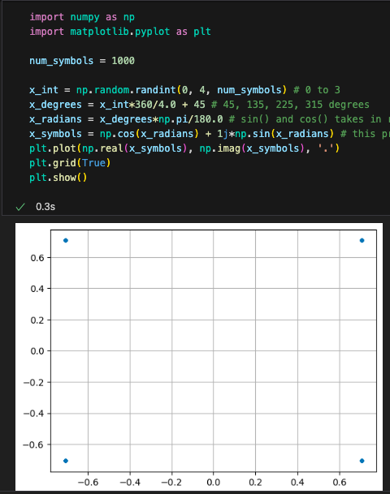
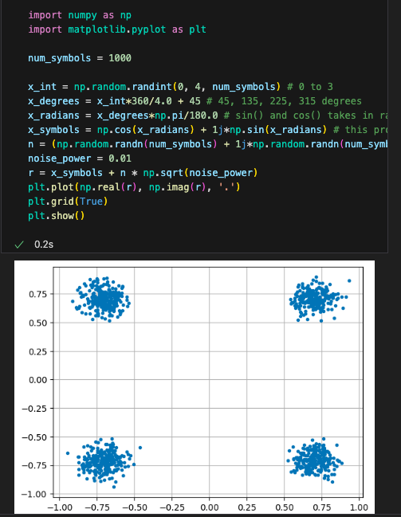

<h1 align="center"> <b><i><u> pySDR</u></i></b></h1>
<h2>1. Introduction</h2>

<b><i>SDR</i></b>- SDR stands for software Defined Radio, which is nothing but an alternative to those old hardwares connected to radios to transmit and receive signals  It is very flexible compared to those hardwares, to modulate/demodulate frequencies you just have to change the code and boom!  
<b><i>DSP</i></b>- It stands for Digital Signal Processing, whenever we receive a signal using SDR, we convert it into complex numbers and perform math/programming on that to extract information is called DSP
<h2>2. Frequency domain</h2>

<b><i>Fourier Series</i></b>- Any signal is made up by summing up multiple sine waves, so its constituent sine waves are called fourier series 
<b><i>Fourier Transform</i></b>- The conversion of a frequency phase to time phase or reverse is called Fourier Transform 
<b><i>FFT</i></b>- It stands for Fast Fourier Transform, It is just an algorithm to perform Fourier Transform  
 ex. We have a sine wave: 

  To use FFT we just have to add one line,  
 
<b><i>Windowing</i></b>- FFT assumes that a slice of signal continues infinitely so it connects the end and starting, but due to having differenct characterstics and both end and start it does't blend nicely and so to correct that, we just multiply starting and ending with zero phase(Hamming) which makes them connect super neatly and reduces error. 
To perform windowing we just have to add a line of code to our previous codes:  
 
<h2>3. IQ Sampling</h2>
<ol>
  <li><b>Sampling Basics</b> – Convert analog signal into digital samples using ADC. Sampling rate (<i>Fs</i>) defines how many samples per second are taken.</li>
  
  <li><b>Nyquist Sampling</b> – To avoid aliasing, sample rate must be at least 2× the maximum signal frequency. An anti-aliasing filter removes frequencies above <i>Fs/2</i>.</li>
  
  <li><b>Quadrature (IQ) Sampling</b> – Signal is split into two parts: 
    <ul>
      <li>I (in-phase, cosine component)</li>
      <li>Q (quadrature, sine component, 90° shifted)</li>
    </ul>
    Together they describe amplitude + phase of the signal.</li>
  
  <li><b>Complex Numbers</b> – IQ samples are stored as complex numbers (<i>I + jQ</i>). Represented on a plane with magnitude (strength) and phase (angle).</li>
  
  <li><b>Receiver Side</b> – Antenna captures RF signal → multiplied with cos & sin → two ADCs record I & Q → combined into complex samples.</li>
  
  <li><b>Carrier & Downconversion</b> – Real RF signals are very high freq (GHz). Mixers shift them to baseband (0 Hz) so they can be sampled at lower rates (MHz).</li>
  
  
<h2>4. Digital Modulation</h2>

<b>digital modulation</b> and wireless symbols. We design signals that convey information (1s and 0s) using schemes like ASK, PSK, QAM, and FSK. The main goal is to maximize <i>spectral efficiency</i> (bits/sec/Hz).

</ol>
<ol>
  <li><b>Symbols</b> – A signal is made of <i>symbols</i>. Each symbol carries 1 or more bits. Example: Ethernet uses 4-level ASK → 2 bits per symbol.</li>

  <li><b>Amplitude Shift Keying (ASK)</b> – Vary amplitude of the carrier. 
    <ul>
      <li>2-ASK → 1 bit per symbol</li>
      <li>4-ASK → 2 bits per symbol</li>
    </ul>
    Easily visualized in time domain & IQ plots.</li>

  <li><b>Phase Shift Keying (PSK)</b> – Vary phase of the carrier. 
    <ul>
      <li>BPSK: 0° or 180° phase</li>
      <li>QPSK: 0°, 90°, 180°, 270° → 2 bits per symbol</li>
    </ul>
    Constellation plots show phase states.</li>

  <li><b>IQ Plots & Constellations</b> – Symbols are represented as points on the I/Q plane. Each modulation scheme has a “constellation” (set of valid points).</li>

  <li><b>Quadrature Amplitude Modulation (QAM)</b> – Combines ASK + PSK. Constellations like 16-QAM, 64-QAM, 256-QAM carry multiple bits per symbol, widely used in WiFi and LTE.</li>Gene

  <li><b>For symbol plotting</b> 
   
  </li>
  <li><b>For noise adder</b> 
   
  </li>
</ol>
</ol>

